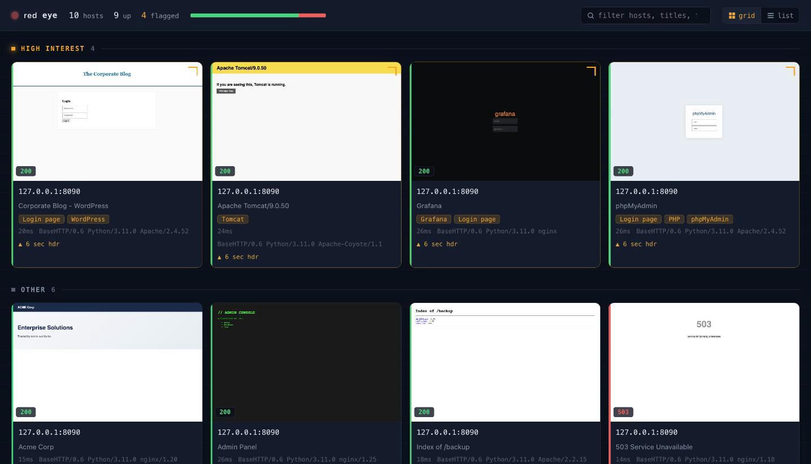
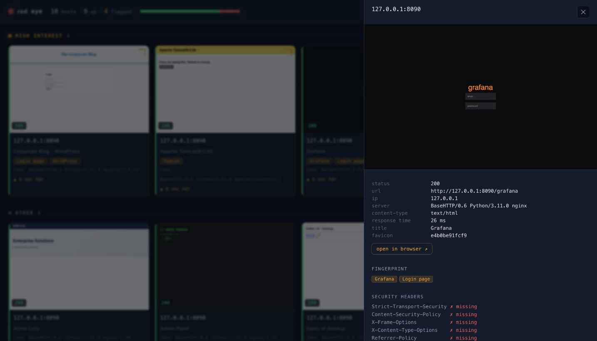

<h1 align="center">redeye</h1>

<p align="center">
  Screenshot and recon a set of web targets into one self-contained HTML report —<br>
  the terminal equivalent of opening 300 hosts in a browser and eyeballing them, in one command.
</p>

<p align="center">
  
  
  
  
</p>

<p align="center"></p>

<p align="center"><i>The report groups hosts so the interesting stuff — known apps, login pages — floats to the top.</i></p>

```bash
redeye -f urls.txt
redeye -x scan.xml -k
redeye --single https://example.com
```

## Why

[EyeWitness](https://github.com/RedSiege/EyeWitness) and
[Aquatone](https://github.com/michenriksen/aquatone) do exactly this job, but on
**Apple Silicon** they're painful: x86-only binaries under emulation, Docker
workarounds, or Selenium/geckodriver dependency hell.

redeye runs **natively on ARM64** with none of that. It uses
[Playwright](https://playwright.dev/python/), which installs a native-ARM
Chromium — so there's **no Docker, no Selenium, no x86 emulation**. One `pip`
install and one `playwright install chromium`, and you have a working recon
screenshotter.

## Install

```bash
pipx install .
# then, one time, fetch the native ARM64 browser:
playwright install chromium
```

Or from a clone, for development:

```bash
pip install -e ".[dev]"
playwright install chromium
```

Requires Python 3.10+. If you run redeye before installing the browser, it
prints the exact `playwright install chromium` command and exits — no traceback.

## Usage

redeye takes targets from any combination of three sources:

```bash
# a line-separated file of URLs or host[:port] entries
redeye -f urls.txt

# an Nmap XML scan — open web ports become targets automatically
redeye -x scan.xml

# a single target
redeye --single https://10.10.10.5:8443

# options
redeye -f urls.txt --threads 20 --timeout 15   # more workers, longer timeout
redeye -x scan.xml -k                           # ignore self-signed cert errors
redeye -f hosts.txt --scheme http               # force http for bare hosts
redeye -f urls.txt -d engagement_report         # choose the output dir
```

### Input formats

**URL / host file (`-f`)** — one entry per line; `#` comments and blank lines
are ignored:

```
https://example.com          # full URLs used as-is
scanme.nmap.org              # bare host: scheme guessed (auto = https then http)
10.10.10.5:8080              # :8080 → http, :8443 → https
```

**Nmap XML (`-x`)** — run Nmap with `-oX`, then point redeye at it:

```bash
nmap -sV -p- -oX scan.xml 10.10.10.0/24
redeye -x scan.xml
```

redeye extracts every **open** port that is web-ish — 80, 443, 8000, 8080, 8443,
8888, or any port whose service name contains `http` — builds `http://` /
`https://` URLs (ssl/tls ports and 443/8443 become https), prefers the hostname
from the XML over the IP, and skips hosts Nmap marked down.

**Scheme for bare hosts (`--scheme`)** — `auto` (default) uses the port to
decide, falling back to https; `http` or `https` forces one.

## The report

redeye writes a timestamped output directory (override with `-d`):

```
redeye_20261004_181500/
├── report.html        ← open this
├── results.json       ← machine-readable, for scripting
└── screens/           ← full-page PNG screenshots
```

Open `report.html` in any browser. It's a **responsive thumbnail grid** — each
card shows the screenshot, URL, color-coded status (2xx green, 3xx cyan, 4xx
yellow, 5xx/timeout red), page title, `Server` header, and technology tags.
Click a thumbnail for the full screenshot.

**The interesting stuff floats up.** Cards are grouped with a **High interest**
section first — anything fingerprinted as a known application (WordPress,
Tomcat, Jenkins, Grafana, …) or a login page — then one section per technology,
then everything else. That ordering is what makes a 300-host report usable:
you scan the top, not the whole thing.

**Progressive disclosure.** Each card shows only the essentials (screenshot,
status, host, tech tags, response time, and a flag when security headers are
missing). Click any card and a detail panel slides in with the full recon for
that host: TLS certificate, the complete security-header checklist, the redirect
chain it followed, resolved IP, favicon hash, and the raw response headers. The
grid stays scannable; the depth is one click away when you want it.

<p align="center"></p>

**Grid or list.** A toggle in the console bar switches between the thumbnail
**grid** (eyeball the screenshots) and a dense **list** (scan the data). Your
choice is remembered per browser.

A **filter box** narrows cards by URL, title, or tag as you type, and a status
meter in the bar shows the 2xx/3xx/4xx/5xx breakdown at a glance. All plain JS,
no build step.

`results.json` carries everything for piping into other tools: each target's
final URL, status, both header sets (browser + independent `httpx` fetch), TLS
facts, security headers, redirect chain, IP, timing, favicon hash, title, and
tech tags.

## How it works

1. **inputs** (`redeye/inputs.py`) normalize the file / Nmap XML / single target
   into one deduplicated list of URLs to visit.
2. **capture** (`redeye/capture.py`) visits them concurrently with an asyncio
   worker pool (`--threads`). Each target gets its own browser context, a
   full-page screenshot, and a rich set of facts: status, title, headers, TLS
   certificate, security-header presence, redirect chain, resolved IP, response
   time, content-type, and a favicon hash. A **separate** `httpx` request fetches
   headers independently — if the two disagree (a header fetch times out but the
   screenshot renders, say), both are recorded. A dead, slow, or hostile host
   becomes a recorded outcome (`timeout` / `error`), never a crash, and never
   blocks the other workers.
3. **fingerprint** (`redeye/fingerprint.py`) applies a small, readable rules
   table (`{label: [signatures]}`) over the headers + body. It's a hint, not
   Wappalyzer — and trivial to extend: add a line to `RULES`.
4. **report** (`redeye/report.py` + `redeye/template.py`) renders the grouped
   HTML with Jinja2 and writes `results.json`.

## Extending the fingerprint

Edit the `RULES` dict in `redeye/fingerprint.py`:

```python
RULES = {
    "WordPress": ["/wp-content/", "wp-login", "x-pingback"],
    "My App":    ["x-myapp-version", "powered by myapp"],  # add your own
}
```

Signatures are plain case-insensitive substrings matched across the response
headers and body. Add a label to `HIGH_INTEREST` to float its hosts to the top.

## Legal

**Only scan targets you are authorized to test** — lab environments you own,
Hack The Box / TryHackMe and similar, or systems explicitly in scope for an
authorized engagement or bug-bounty program. Pointing redeye at hosts you don't
have permission to assess may be illegal. You are responsible for your use of
this tool.

## Development

```bash
pip install -e ".[dev]"
pytest
```

The tests cover the pure logic — Nmap XML parsing, URL normalization, the
fingerprint rules, status-color mapping, grouping, and report rendering. They
mock everything external: **no test hits a real host or launches a browser.**

## License

MIT — see [LICENSE](LICENSE).
